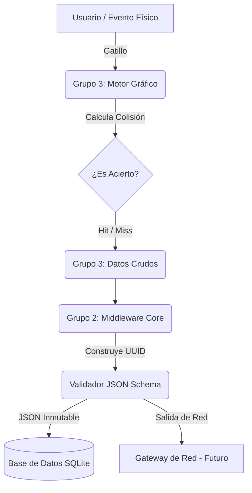

# DOCUMENTACIÓN DEL TRABAJO REALIZADO
**Software – Grupo 3: Interfaz Gráfica (GUI), Lógica de Colisiones e Integración Base**

---

## 1. Objetivo de nuestro trabajo
El Grupo 3 tuvo como objetivo principal desarrollar el motor gráfico y la lógica balística del **Prototipo de Simulación de Tiro Inalámbrico**. Nuestra responsabilidad abarcó desde el diseño inmersivo y responsivo de una diana geométrica, pasando por el cálculo matemático de colisiones en tiempo real, hasta la asimilación e integración de herramientas de formateo de datos (Middleware) para dejar el proyecto preparado para interactuar con sistemas de hardware a través de la red.

En una **Fase 2 (High-Fidelity)**, expandimos masivamente el alcance del proyecto original incorporando perfiles de usuario, persistencia de datos local, un motor de síntesis de audio procedural y físicas de movimiento dinámico para la diana.

---

## 2. Tecnologías Utilizadas
Para lograr un entorno robusto, responsivo y profesional, se empleó:
* **Python 3.13**: Lenguaje base para toda la lógica orientada a objetos.
* **Pygame 2.6.1**: Framework utilizado para la aceleración gráfica por hardware (`DOUBLEBUF | SRCALPHA`) y el motor de audio (`pygame.mixer`).
* **NumPy**: Implementado para generar ondas matemáticas de sonido sintético en tiempo real, eliminando la dependencia de archivos de audio externos.
* **SQLite3**: Motor de base de datos relacional integrado nativamente para persistir el historial de tiradores y almacenar las tramas JSON de red.
* **PyInstaller**: Utilizado para empaquetar toda la solución, los recursos y los esquemas de validación en un único binario portable `.exe`.
* **jsonschema**: Requisito asimilado del Grupo 2 para llevar a cabo validaciones estrictas del protocolo de comunicación.

---

## 3. Lógica y Desarrollo del Simulador (GUI)

### 3.1. Cálculo de Colisiones y Físicas
Para determinar si un disparo es un acierto (*hit*) o un fallo (*miss*), implementamos una comprobación de distancia euclidiana (Teorema de Pitágoras) desde el centro exacto de la diana hacia las coordenadas del puntero en el momento del evento de disparo. Además, implementamos un modo "Diana Dinámica", dándole a la entidad vectores de aceleración (`vx`, `vy`) para que rebote proceduralmente por los bordes de la pantalla, aumentando el nivel de dificultad táctica. Dicho movimiento puede ser congelado en tiempo real pulsando la tecla `M`, lo cual ancla la diana instantáneamente en el centro del monitor.

### 3.2. Arquitectura de Pantallas (State Machine)
El programa ya no es una vista estática, sino una máquina de estados:
1. **Pantalla de Identificación (Perfil):** Interfaz táctica que solicita al operador ingresar su nombre.
2. **Pantalla de Calibración:** Un paso de alineación de hardware donde un escáner guía al usuario a hacer clic en las esquinas de la pantalla para mapear correctamente la resolución física.
3. **Simulador Principal:** El entorno inmersivo de tiro que renderiza el HUD y aplica *Screen Shake* y rastros térmicos de quemadura al impactar.

### 3.3. Síntesis de Audio (SFX)
En lugar de cargar pesados archivos `.wav` de internet, desarrollamos una clase `AudioManager` que utiliza el procesador para **generar ondas acústicas matemáticamente**. 
* **Disparo:** Se genera inyectando ruido blanco en un arreglo `numpy` y aplicando una curva de decaimiento exponencial rápida.
* **Acierto (Hit):** Se superponen dos ondas senoidales de alta frecuencia (1200Hz) creando un sonido similar a una campana metálica de polígono ("Ding").
* **Fallo (Miss):** Se inyecta una onda grave descendente desde los 150Hz para emular un impacto sordo ("Thud").

---

## 4. Integración del Middleware y Base de Datos (Grupo 2)

El mayor desafío a nivel de software fue conectar nuestras interacciones en pantalla con las rígidas reglas del **Grupo 2**. Como Grupo 3, asimilamos su código `core/` directamente en nuestra tubería, y sumamos una capa de persistencia propia.

1. **Obtención:** Nuestro simulador expulsa un diccionario crudo (`{"result": "hit", "x": 690, "y": 351}`).
2. **Formateo:** La lógica del Grupo 2 convierte eso en un Modelo UUID y lo empaqueta a JSON.
3. **Validación:** Se valida el esquema usando `jsonschema`.
4. **Persistencia (Nueva Fase 2):** El JSON resultante, en lugar de solo imprimirse en consola, se inserta en nuestra base de datos local `tiro_simulator.db` en la tabla `shots`, la cual está relacionada mediante Foreign Key al nombre del usuario que está disparando.

---

## 5. Arquitectura del Flujo de Datos

A continuación se ilustra la arquitectura de software construida e integrada dentro de nuestro ejecutable:



### Salida Exacta (JSON Output)
Tras procesar un disparo, el flujo unificado del Grupo 3 + Grupo 2 expulsa el siguiente bloque de red validado que llega a la Base de Datos y al Gateway:
```json
{
  "version": "1.0",
  "type": "shot_result",
  "shot_id": "fef4bb69-5f90-414f-8306-3f6f1845e8fc",
  "timestamp": "2026-06-17T00:31:29.528552Z",
  "source": {
    "module": "gui"
  },
  "result": "hit",
  "feedback": {
    "led": "green",
    "duration_ms": 500
  },
  "coordinates": {
    "x": 690,
    "y": 351
  }
}
```

---

## 6. Manual de Despliegue Rápido
Se ha logrado independizar completamente el proyecto del entorno de desarrollo. No se requiere que el cliente final o el profesor instale Python.

1. Navegar a la carpeta principal del proyecto.
2. Hacer doble clic sobre `SimuladorTiro_Grupo3.exe`.
3. Ingresar las credenciales en el Menú Táctico.
4. (Opcional) Pulsar espacio para saltar la calibración o hacer clic en las esquinas.
5. Utilizar la barra espaciadora para emular disparos, y la tecla `M` para activar/desactivar las físicas de movimiento de la diana.
6. Todos los registros quedarán almacenados offline en la carpeta `db/tiro_simulator.db`.

---

## 7. Proyección hacia el Futuro: Integración de Hardware

El ecosistema físico-virtual se cerrará orquestando a todos los grupos de la siguiente manera:
1. **Capa Física (Grupo 1 y 2):** Un ESP32 recolecta telemetría analógica de los potenciómetros (joystick) y lee la interrupción del gatillo.
2. **Capa de Red (Grupo 1):** Un Gateway TCP/WebSocket inyecta los voltajes en Windows moviendo el cursor y envía la señal a nuestro `main.py` de disparo.
3. **Capa de Procesamiento (Grupo 3 y 2):** Calculamos la colisión acústica/visual y emitimos el JSON validado con el color de la orden del LED (e.g., `"led": "green"`).
4. **Ciclo de Retroalimentación:** El Gateway de Red captura el JSON y le ordena al ESP32 por Wi-Fi encender el LED verde, unificando la experiencia virtual con la física táctil.

---

## 8. Proyección de Realismo Militar (High-Fidelity Simulator)

Si el objetivo a largo plazo fuese crear un sistema de entrenamiento balístico industrial para fuerzas tácticas, nuestra arquitectura base actual permitiría escalar hacia:
* **Retroceso Háptico Real:** Uso de réplicas exactas con cilindros de CO2 o solenoides que pateen físicamente al gatillar.
* **Sensores Inerciales (IMU):** El arma enviaría giroscopios y acelerómetros precisos, transmitiendo el "Yaw, Pitch y Roll" real del cañón.
* **Físicas Balísticas Complejas:** Pasar de Pygame 2D a un motor 3D, donde el motor balístico del Grupo 3 tenga que calcular caída de bala gravitacional (Bullet Drop), fuerza y resistencia del viento (Windage), humedad y Efecto Coriolis.
* **Extensión de Middleware:** El Grupo 2 expandiría el JSON para portar vectores flotantes de telemetría de estrés, presión de gatillo y ritmo cardíaco biométrico.

---

## 9. Conclusión

El Grupo 3 ha superado de forma holística sus obligaciones técnicas. Se logró un motor interactivo con físicas y audio procedural sin dependencias externas. Se asimiló y respetó a nivel de bytes el protocolo del Grupo 2, pero agregándole una superestructura de base de datos relacional y perfiles de usuario. El proyecto es ahora una plataforma orientada a servicios, probada, persistente y empaquetada en un binario autónomo, excediendo el alcance de un simulador educativo para rozar los estándares de un producto de simulación comercial listo para acoplar el hardware.
