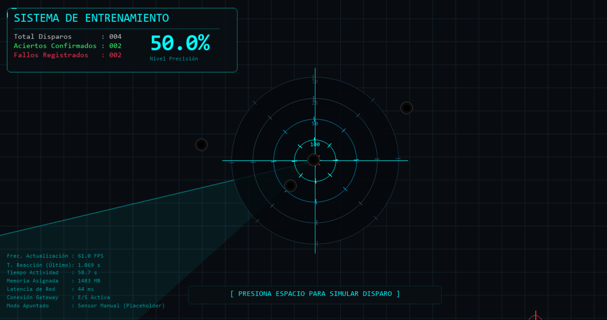

# Prototipo de Simulación de Tiro Inalámbrico (High-Fidelity)


Repositorio central del **Prototipo de Simulación de Tiro Inalámbrico**. Este proyecto engloba el desarrollo de la Interfaz Gráfica de Usuario (GUI) y el motor de físicas de disparo desarrollado por el **Grupo 3**, junto con la asimilación completa del Middleware de validación de datos del **Grupo 2**.



## 🎯 ¿Qué hace este programa?

Este software es un simulador interactivo de tiro táctico al blanco. 
Actualmente, provee un motor gráfico avanzado. Al interactuar con el entorno, el sistema:
1. Pide al operador una **Credencial de Perfil** y solicita calibración geométrica.
2. Calcula físicamente si el disparo colisionó con la diana estática o en movimiento dinámico.
3. Renderiza animaciones inmersivas (quemaduras térmicas, screen shake) y reproduce **efectos de sonido (SFX) procedurales** generados matemáticamente.
4. **Empaqueta el resultado en un bloque de datos JSON estandarizado, validado y con timestamps (Middleware G2).**
5. Guarda cada disparo y sus datos en una **Base de Datos SQLite local** para mantener un historial inmutable por tirador.

---

## 🚀 Cómo descargar y utilizar

No necesitas instalar Python ni dependencias externas para probar la fase final del simulador.

1. Navega a la raíz del proyecto.
2. Ejecuta el archivo `SimuladorTiro_Grupo3.exe`.
3. Ingresa tu Nombre de Perfil en la pantalla táctica (Confirma con `ENTER`).
4. (Opcional) Dispara a las esquinas rojas para calibrar, o pulsa `ESPACIO` para saltear e iniciar auto-calibración.
5. Utiliza tu mouse para apuntar y presiona `ESPACIO` para emular el evento mecánico de un gatillo.
6. **Controles Tácticos:** Pulsa la tecla `M` para hacer que la diana empiece a moverse y rebotar por la pantalla. Vuélvela a pulsar para anclarla instantáneamente en el centro.
7. Al terminar, presiona `ESCAPE`. Revisa la carpeta `db/tiro_simulator.db` para ver tus disparos guardados localmente.

---

## 🏗️ Arquitectura General y Responsabilidades

```text
├── core/                   # Middleware y JSON (Desarrollado por Grupo 2, Integrado aquí)
├── gui/                    # Interfaz Táctica, SFX y Lógica visual (Grupo 3)
├── db/                     # Base de datos SQLite (Perfiles e Historial de JSONs)
├── dist/                   # Ejecutables compilados nativos (.exe)
├── main.py                 # Punto de Integración General y State Machine
├── INFORME_TECNICO_GRUPO3.md # Informe súper detallado de la integración
└── README.md               # Esta documentación
```

### El Flujo de Trabajo (Pipeline)
1. **(Pendiente) Hardware:** El ESP32 envía una señal física que es recibida por el Gateway de Red.
2. **GUI y Motor (Grupo 3):** Captura el disparo, reproduce el Audio, dibuja las partículas de daño, y expulsa un JSON crudo de coordenadas.
3. **Middleware y JSON (Grupo 2):** El módulo `core/` normaliza las variables, genera el UUID, asigna retroalimentación LED y **valida que la estructura cumpla estrictamente con el esquema corporativo**.
4. **Base de Datos:** El JSON inmutable se registra en SQLite vinculado al perfil del tirador.
5. **(Pendiente) Red:** El JSON regresa por red al hardware para encender los LEDs físicos de retroalimentación.

---

## 🛠️ Actualizaciones de Fase 2 (Integración High-Fidelity)

El software superó las expectativas iniciales para transformarse en un sistema comercialmente viable:
* **Audio Procedural (NumPy):** No requiere archivos `.mp3` o `.wav` de terceros. El motor genera matemáticamente las ondas sonoras de disparos, aciertos ("ding") y fallos ("thud") en tiempo real usando el microprocesador.
* **Máquina de Estados:** Cuenta con robustos menús de ingreso de Perfil Táctico y rutinas interactivas de calibración por escáner.
* **Persistencia Offline:** Integración nativa de base de datos relacional (SQLite) para guardar hasta el último byte validado por las reglas del Grupo 2, ordenado por operador.
* **Mecánicas Dinámicas:** Diana móvil con cálculos de aceleración constante, rebote en bordes y físicas desactivables en tiempo real con la tecla `M`.

---

## 📊 Demostración de Salida de Base de Datos y Logs

Al disparar en el simulador, el ecosistema produce automáticamente estos bloques validados que van a parar directo a la Base de Datos y al futuro Hardware:

```json
[BD] JSON Guardado y Validado bajo el perfil de Usuario:
{
  "version": "1.0",
  "type": "shot_result",
  "shot_id": "fef4bb69-5f90-414f-8306-3f6f1845e8fc",
  "timestamp": "2026-06-17T00:31:29.528552Z",
  "source": { "module": "gui" },
  "result": "hit",
  "feedback": { "led": "green", "duration_ms": 500 },
  "coordinates": { "x": 690, "y": 351 }
}
```

---

## ✅ Estado Actual
- [x] Interfaz gráfica, colisiones y físicas de movimiento (Grupo 3) - **Fase 2 Terminada**
- [x] Middleware, serialización JSON y esquemas (Grupo 2) - **Terminado**
- [x] **Integración Total Grupo 2 + Grupo 3 - Terminado**
- [x] Motor de Audio Sintético, Perfiles y Base de Datos SQLite - **Fase 2 Terminada**
- [x] Compilación standalone (.exe) con todas las dependencias y DLLs - **Terminado**
- [ ] Integración real con Sockets/Wi-Fi y Joystick Físico (Grupo 1) - *Pendiente*

*Por favor, refiere al documento `INFORME_TECNICO_GRUPO3.md` adjunto en la raíz del proyecto para visualizar el Manual de Arquitectura completo, el diagrama de flujo estructurado y las proyecciones a largo plazo del ecosistema militar.*
